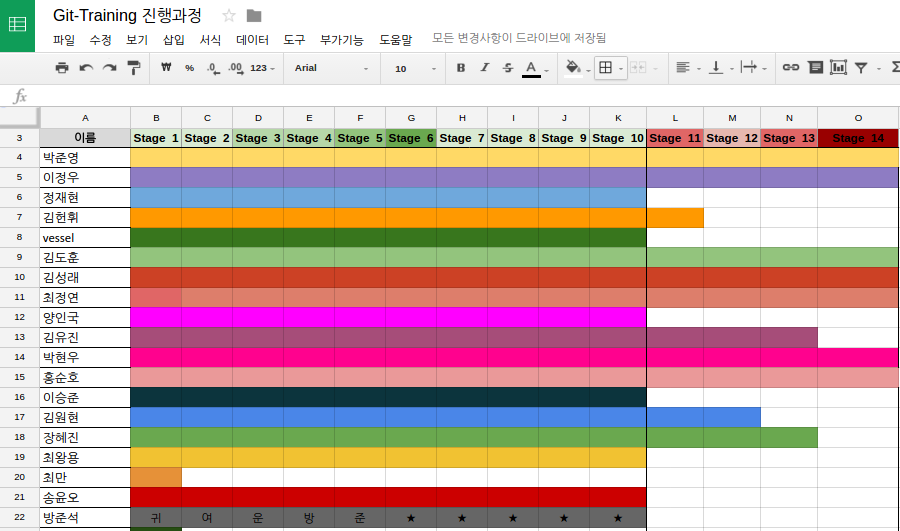

## Git Training

##### Don't think about git, just do git !
##### (Based on a scenario; c programming with Git (Knapsack problem))
### Training Environment

1. Download [tutorial](https://www.dropbox.com/s/0bplreunw6vf69p/Git-training.pdf?dl=1&pv=1) & [example code for this scenario](https://www.dropbox.com/sh/9q2emkhxmyckoj6/AAA_H55BVhfRvGHOs9j7l9N2a?dl=1&pv=1)
2. Install Git ([git](https://git-scm.com/downloads), [source tree](https://www.sourcetreeapp.com))
3. Editor ([atom](https://atom.io/), [sublime text](https://www.sublimetext.com/3))
4. Github account ([sign up](https://github.com/join))
5. Download [the courage](https://www.dropbox.com/s/36ifeasvhhshqj8/you_can_do_git?dl=1&pv=1)

### Stage
1. Basic : Stage 1 ~ 10
2. Advanced : Stage 11 ~ 14

### The results

[git-training.docs.google](https://docs.google.com/spreadsheets/d/1uPMCOKISMgj_svsoxG1LF1RbozA9RMKfx7h9vT80Atc/edit#gid=0)